# SAP Knowledge Graph — LinkedIn Post v1.0

## LinkedIn Post Content

---

**🚀 I built an MCP server that queries an SAP Knowledge Graph stored in SAP HANA — and renders it as a live Mermaid diagram**

Context: Enterprise data at scale often lives in disconnected silos — ERP, CRM, Cloud, AI platforms. The question I kept asking myself: **what if we could navigate these connections like a graph?**

**The stack:**
- 🔧 **SAP HANA Cloud** — stores the knowledge graph (VERTICES + EDGES tables)
- 🔧 **BTP MCP Server** (Python/FastMCP) — exposes MCP protocol over streamable HTTP on CF
- 🔧 **Prompt templates** — `sap_kg_mermaid` prompt renders the KG as a Mermaid diagram in real-time
- 🔧 **Mission Control** dashboard — Next.js frontend that fetches the diagram via an API route

**Key insight from the graph:**
SAP_Joule is at the center — it *provides* enterprise_search, conversational_AI, workflow_automation, agentic_tasks, and contextual_insights. It *integrates_with* S/4HANA, BW, HANA, Datasphere, BTP, and AI Core simultaneously.

That multi-integration pattern is exactly what makes Joule powerful as a unified business AI layer — and the graph makes it visible.

**The MCP prompts that make this work:**
- `sap_kg_mermaid` → renders the full KG as Mermaid (or filtered by topic)
- `sap_kg_path_finder` → shows the shortest path between two SAP concepts
- `sap_materials_ascii` → ASCII table + bar chart from MATERIALS table

All running live at: `hana-mcp.cfapps.us10-001.hana.ondemand.com/mcp`

**What this enables:**
- Natural language queries against structured SAP data
- Visual concept exploration for architects and consultants
- MCP clients (Claude, Cursor, OpenClaw) can call these tools and prompts directly

The graph has 40 vertices, 39 edges, and runs entirely on SAP BTP managed infrastructure.

Would love to hear how others are using MCP + SAP HANA for enterprise AI use cases.

#SAP #SAPBTP #MCP #ModelContextProtocol #SAPJoule #SAPHANA #KnowledgeGraph #EnterpriseAI #SAPTech

---

## Mermaid Diagram (export as PNG for LinkedIn)

```mermaid
graph TD
    4["SAP_HANA"]
    1["SAP_Joule"]
    2["SAP_S4HANA"]
    3["SAP_BW"]
    6["SAP_BTP"]
    7["SAP_AI_Core"]
    14["enterprise_search"]
    13["conversational_AI"]
    12["SAP_HANA_Cloud"]
    11["SAP_Analytics_Cloud"]
    15["workflow_automation"]
    20["finance_management"]
    10["SAP_Build_Apps"]
    18["contextual_insights"]
    19["ERP_functions"]
    17["agentic_tasks"]
    16["document_understanding"]
    9["SAP_Integration_Suite"]
    8["SAP_Foundation_AI"]
    5["SAP_Datasphere"]
    1 --> |"provides"| 13
    1 --> |"integrates_with"| 2
    1 --> |"integrates_with"| 3
    1 --> |"integrates_with"| 4
    1 --> |"integrates_with"| 5
    1 --> |"integrates_with"| 6
    1 --> |"integrates_with"| 7
    1 --> |"uses"| 8
    1 --> |"provides"| 14
    1 --> |"provides"| 15
    1 --> |"provides"| 16
    1 --> |"provides"| 17
    1 --> |"provides"| 18
    2 --> |"provides"| 19
    2 --> |"provides"| 20
    2 --> |"provides"| 21
    2 --> |"provides"| 22
    2 --> |"supports"| 23
    2 --> |"integrates_with"| 4
    2 --> |"integrates_with"| 6
    2 --> |"integrates_with"| 9
    2 --> |"integrates_with"| 10
    3 --> |"provides"| 24
    3 --> |"provides"| 25
    3 --> |"provides"| 26
    3 --> |"provides"| 27
    3 --> |"integrates_with"| 4
    3 --> |"integrates_with"| 2
    3 --> |"integrates_with"| 11
    4 --> |"provides"| 29
    4 --> |"provides"| 30
    4 --> |"provides"| 31
    4 --> |"provides"| 32
    4 --> |"provides"| 33
    4 --> |"provides"| 34
    4 --> |"provides"| 35
    4 --> |"provides"| 36
    4 --> |"integrates_with"| 6
    4 --> |"integrates_with"| 7
    12 --> |"is_a"| 4
```

---

## Metadata

- **Author:** Ert | SAP Cloud Architect
- **Date:** 2026-05-17
- **Tags:** #SAP #SAPBTP #MCP #ModelContextProtocol #SAPJoule #SAPHANA #KnowledgeGraph #EnterpriseAI
- **Assets:** mermaid live URL → https://mermaid.ink/img/PG1lcm1lYWQgbm9kZXN0eXBlPXRkCkdyYXBoIFRECiAgNCgiU0FQX0hBTkEiKQogIDEoIlNBUF9Kb3VsZSIpCiAgMigiU0FQX1M0SEFOQSIpCiAgMygiU0FQX0JXIikKICA2KCJTQVBfQlRQIgogIDcoIlNBUF9BSV9Db3JlIgogIDE0KCJlbnRlcnByaXNlX3NlYXJjaCIpCiAgMTMoImNvbnZlcnNhdGlvbmFsX0FJIgogIDEyKCJTQVBfSEFOQV9DbG91ZCIpCiAgMTEoIlNBUF9BbmFseXRpY3NfQ2xvdWQiKQogIDE1KCJ3b3JrZmxvd19hdXRvbWF0aW9uIgogIDIwKCJmaW5hbmNlX21hbmFnZW1lbnQiKQogIDEwKCJTQVBfQnVpbGRfQXBwcyIpCiAgMTgoImNvbnRleHR1YWxfaW5zaWdodHMiKQogIDE5KCJFUlBfZnVuY3Rpb25zIgogIDE3KCJhZ2VudGljX3Rhc2tzIgogIDE2KCJkb2N1bWVudF91bmRlcnN0YW5kaW5nIgogIDkoIlNBUF9JbnRlZ3JhdGlvbl9TdWl0ZSIpCiAgOCgiU0FQX0ZvdW5kYXRpb25fQUkiKQogIDUoIlNBUCVEYXRhc3BoZXJlIikKICAxIC0tPiAiUHJvdmlkZXMiIHwgbGFiZWw6IDEzCiAgMSAtLT4gIkludGVncmF0ZXMiIHwgbGFiZWw6IDIKICAxIC0tPiAgSW50ZWdyYXRlcyB8IGxhYmVsOiAzCiAgMSAtLT4gSW50ZWdyYXRlcyB8IGxhYmVsOiA0CiAgMSAtLT4gSW50ZWdyYXRlcyB8IGxhYmVsOiA1CiAgMSAtLT4gSW50ZWdyYXRlcyB8IGxhYmVsOiA2CiAgMSAtLT4gSW50ZWdyYXRlcyB8IGxhYmVsOiA3CiAgMSAtLT4gVXNlcyB8IGxhYmVsOiA4CiAgMSAtLT4gUHJvdmlkZXMiIHwgbGFiZWw6IDE0CiAgMSAtLT4gUHJvdmlkZXMiIHwgbGFiZWw6IDE1CiAgMSAtLT4gUHJvdmlkZXMiIHwgbGFiZWw6IDE2CiAgMSAtLT4gUHJvdmlkZXMiIHwgbGFiZWw6IDE3CiAgMSAtLT4gUHJvdmlkZXMiIHwgbGFiZWw6IDE4Cg==
- **Image:** https://mermaid.ink/img/Z3JhcGggVEQKICAgIDRbIlNBUF9IQU5BIl0KICAgIDFbIlNBUC5Kb3VsZSJdCiAgICAyWyJTQVBfUzRIQU5BIl0KICAgIDNbIlNBUC5CVyJdCiAgICA2WyJTQVBfQlRQIl0KICAgIDdbIlNBUC5BSV9Db3JlIl0KICAgIDE0WyJlbnRlcnByaXNlX3NlYXJjaCJdCiAgICAxM1siY29udmVyc2F0aW9uYWxfQUkiXQogICAgMTJbIlNBUC5IQU5BX0Nsb3VkIl0KICAgIDExWyJTQVBfQW5hbHl0aWNzX0Nsb3VkIl0KICAgIDE1WyJ3b3JrZmxvd19hdXRvbWF0aW9uIgogICAgMjBbImZpbmFuY2VfbWFuYWdlbWVudCIpCiAgICAxMFsiU0FQX0J1aWxkX0FwcHMiXQogICAgMThbImNvbnRleHR1YWxfaW5zaWdodHMiKQogICAgMTlbIkVSUF9mdW5jdGlvbnMiKQogICAgMTdbImFnZW50aWNfdGFza3MiKQogICAgMTZbImRvY3VtZW50X3VuZGVyc3RhbmRpbmciKQogICAgOSgiU0FQX0ludGVncmF0aW9uX1N1aXRlIgogICAgOCgiU0FQX0ZvdW5kYXRpb25fQUkiKQogICAgNVsiU0FQX0RhdGFzcGhlcmUiKQogICAgMSAtLT4gfCJwcm92aWRlcyJ8IDEzCiAgICAxIC0tPiB8ImludGVncmF0ZXNfd2l0aCJ8IDIKICAgIDEgLS0-IHwiaW50ZWdyYXRlc193aXRoInwgMwogICAgMSAtLT4gfCJpbnRlZ3JhdGVzX3dpdGgifCA0CiAgICAxIC0tPiB8ImludGVncmF0ZXNfd2l0aCJ8IDUKICAgIDEgLS0-IHwiaW50ZWdyYXRlc193aXRoInwgNgogICAgMSAtLT4gfCJpbnRlZ3JhdGVzX3dpdGgifCA3CiAgICAxIC0tPiB8InVzZXMifCA4CiAgICAxIC0tPiB8InByb3ZpZGVzInwgMTQKICAgIDEgLS0-IHwicHJvdmlkZXMifCAxNQogICAgMSAtLT4gfCJwcm92aWRlcyJ8IDE2CiAgICAxIC0tPiB8InByb3ZpZGVzInwgMTcKICAgIDEgLS0-IHwicHJvdmlkZXMifCAxOAogICAgMiAtLT4gfCJwcm92aWRlcyJ8IDE5CiAgICAyIC0tPiB8InByb3ZpZGVzInwgMjAKICAgIDIgLS0-IHwiaW50ZWdyYXRlc193aXRoInwgNAogICAgMiAtLT4gfCJpbnRlZ3JhdGVzX3dpdGgifCA2CiAgICAyIC0tPiB8ImludGVncmF0ZXNfd2l0aCJ8IDkKICAgIDIgLS0-IHwiaW50ZWdyYXRlc193aXRoInwgMTAKICAgIDMgLS0-IHwiaW50ZWdyYXRlc193aXRoInwgNAogICAgMyAtLT4gfCJpbnRlZ3JhdGVzX3dpdGgifCAyCiAgICAzIC0tPiB8ImludGVncmF0ZXNfd2l0aCJ8IDExCiAgICA0IC0tPiB8ImludGVncmF0ZXNfd2l0aCJ8IDYKICAgIDQgLS0-IHwiaW50ZWdyYXRlc193aXRoInwgNwogICAgMTIgLS0-IHwiaXNfYSJ8IDQ